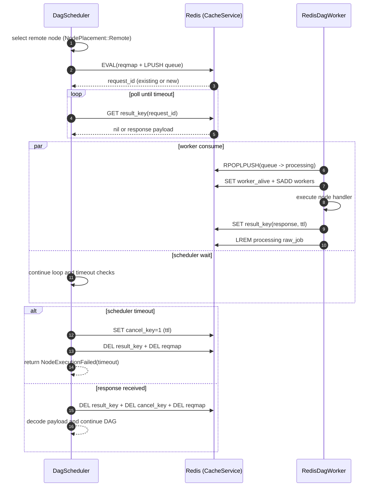

# DAG Runbook / DAG 运行手册

## Audience / 适用对象

EN:
This runbook is for test engineers, SRE, and on-call developers operating DAG workloads.

ZH:
本文档面向测试工程师、SRE 与值班开发，用于 DAG 运行、观测与故障处理。

## 1. Operational Workflow / 运行流程

### 1.1 Pre-run Checklist / 运行前检查

- Graph has no cycle / 图无环
- Node IDs are unique / 节点 ID 唯一
- Retry policy is explicit / 重试策略明确
- Timeout is configured for external calls / 外部调用配置超时
- Metrics pipeline is alive / 指标链路可用
- If fencing enabled, run guard provides token / 开启 fencing 时 run guard 必须提供 token

### 1.2 Standard Run / 标准执行

```powershell
cargo test schedule::dag
```

For a single test / 单测执行:

```powershell
cargo test schedule::dag::tests::TEST_NAME -- --exact
```

### 1.3 Windows Lock Recovery / Windows 锁冲突恢复

EN:
If you hit linker lock (`LNK1104`) or artifact lock waiting, kill stale processes and rerun.

ZH:
如果遇到 `LNK1104` 或 artifact directory file lock，先清理残留进程再重跑。

```powershell
Get-Process | Where-Object { $_.ProcessName -eq 'cargo' -or $_.ProcessName -like 'mocra-*' } | Stop-Process -Force -ErrorAction SilentlyContinue
cargo test schedule::dag
```

## 2. Scheduling Flow / 调度流程

EN:
`execute_parallel()` high-level sequence:

1. Validate DAG
2. Acquire run guard (optional)
3. Pre-check fencing token (if fencing store configured)
4. Start guard heartbeat renew task (optional)
5. Load resume snapshot (optional)
6. Run event-driven dispatch loop
7. Persist/clear snapshot
8. Release run guard
9. Return report

ZH:
`execute_parallel()` 主流程：

1. DAG 校验
2. 获取运行锁（可选）
3. fencing token 前置校验（若配置 fencing store）
4. 启动锁续约任务（可选）
5. 加载恢复快照（可选）
6. 事件驱动调度循环
7. 持久化/清理快照
8. 释放运行锁
9. 返回执行报告

### 2.1 Remote Dispatch Sequence / 远程分发时序图

EN:
The following diagram shows the end-to-end remote dispatch path between scheduler, Redis, and remote worker.

ZH:
下图展示调度器、Redis、远程 Worker 之间的端到端分发路径。



## 3. Consistency Controls / 一致性控制

### 3.1 Run Guard / 运行锁

Purpose / 目的:

- Prevent duplicate concurrent run / 防止同一任务重复并发运行

Failure Signals / 失败信号:

- `RunAlreadyInProgress`
- `RunGuardAcquireFailed`
- `RunGuardRenewFailed`
- `RunGuardReleaseFailed`

Validated behavior / 已验证行为:

- Renew loss fails fast even with long-running in-flight node tasks / 即使存在长时间运行中的节点任务，续约丢失也会快速失败返回
- Run timeout interrupts wait loop quickly and does not wait for slow task completion / 全局运行超时会快速中断等待循环，不会等慢任务自然结束

Verification tests / 验证测试:

- `execute_parallel_run_guard_renew_lost_fails_fast`
- `execute_parallel_run_timeout_interrupts_wait_loop_quickly`

### 3.2 Fencing / 防旧写入

Purpose / 目的:

- Reject stale writer commits / 拒绝旧运行的提交写入

Failure Signals / 失败信号:

- `MissingRunFencingToken`
- `FencingTokenRejected`

### 3.3 Resume Snapshot / 断点恢复

Purpose / 目的:

- Recover from partial success using persisted node outputs / 通过已成功节点输出进行续跑

Risk / 风险:

- Snapshot key collision may resume wrong run / 快照键冲突会导致恢复错跑

## 4. Idempotency Operations / 幂等与去重运维

### 4.1 Singleflight Behavior / Singleflight 行为

EN:
Same `idempotency_key` nodes share owner execution and waiter fulfillment.

ZH:
相同 `idempotency_key` 的节点共用 owner 执行结果，waiter 由 owner 兑现。

### 4.2 Ready Queue Dedup / Ready 队列去重

EN:
Scheduler uses queue + set dedup to avoid duplicate dispatch noise.

ZH:
调度器通过 队列+集合 去重，避免重复入队导致的重复调度噪声。

Verification test / 验证测试:

- `execute_parallel_ready_queue_dedup_avoids_duplicate_dispatch`

## 5. Observability / 可观测性

### 5.1 Core Metrics / 核心指标

- `dag_execute_total`
- `dag_execute_latency_seconds`
- `dag_node_failure_total`
- `dag_run_guard_acquire_total`
- `dag_run_guard_renew_total`
- `dag_run_guard_release_total`
- `dag_run_guard_latency_seconds`
- `dag_remote_dispatch_total`
- `dag_remote_dispatch_latency_seconds`
- `dag_remote_worker_execute_total`
- `dag_remote_worker_execute_latency_seconds`

Run guard renew labels / 运行锁续约结果标签:

- `dag_run_guard_renew_total{result="success"}`: renew succeeded / 续约成功
- `dag_run_guard_renew_total{result="lost"}`: lock ownership lost / 锁所有权丢失
- `dag_run_guard_renew_total{result="error"}`: renew call errored / 续约调用报错
- `dag_run_guard_renew_total{result="failed_final"}`: run finalized as renew failure after execution path / 执行路径收敛后最终以续约失败结束

### 5.2 Sync Stream / 同步状态流

EN:
`DagNodeSyncState` can be consumed from `SyncService` for dashboard or auditing.

ZH:
可通过 `SyncService` 消费 `DagNodeSyncState` 构建看板与审计流水。

## 6. Incident Playbook / 故障处理手册

### Incident A: Run contention / 运行冲突

Symptom / 现象:

- `RunAlreadyInProgress`

Action / 处理:

1. Check owner and lock TTL / 检查锁持有者与 TTL
2. Verify renew interval < TTL / 确认续约间隔小于 TTL
3. Decide retry/backoff policy / 决定重试与退避

### Incident B: Fencing rejection / fencing 拒绝

Symptom / 现象:

- `FencingTokenRejected`

Action / 处理:

1. Confirm token monotonicity / 检查 token 是否单调递增
2. Validate lock ownership handoff / 校验锁 ownership 切换顺序
3. Audit writer order by run_id / 按 run_id 审计写入顺序

### Incident C: State transition error / 状态机错误

Symptom / 现象:

- `InvalidStateTransition`

Action / 处理:

1. Identify node and from/to state / 定位节点和状态迁移
2. Check retry/singleflight branches / 检查重试与 singleflight 分支
3. Add regression test before fix / 修复前先加回归测试

### Incident D: Remote timeout / 远程超时

Symptom / 现象:

- remote dispatch timeout or worker no response

Action / 处理:

1. Check worker heartbeat and queue lag / 检查 worker 心跳与队列积压
2. Verify handler registration / 校验 handler 注册
3. Tune timeout/poll interval / 调整超时与轮询参数

## 7. Test Strategy / 测试策略

### 7.1 Required Regression Set / 必跑回归集

- topology + cycle checks / 拓扑与环检测
- retry + timeout / 重试与超时
- singleflight + idempotency / 幂等与 singleflight
- run guard lock/heartbeat / 运行锁与心跳
- fencing token checks / fencing token 校验
- resume snapshot / 断点恢复
- remote redis dispatch/worker / 远程 redis 调度与 worker

### 7.2 Suggested CI Commands / 建议 CI 命令

```powershell
cargo test schedule::dag
```

Optionally run selected critical cases:

```powershell
cargo test schedule::dag::tests::execute_parallel_fencing_store_requires_run_fencing_token -- --exact
cargo test schedule::dag::tests::execute_parallel_ready_queue_dedup_avoids_duplicate_dispatch -- --exact
cargo test schedule::dag::tests::execute_parallel_run_guard_renew_lost_fails_fast -- --exact
cargo test schedule::dag::tests::execute_parallel_run_timeout_interrupts_wait_loop_quickly -- --exact
```

## 8. Production Checklist / 生产检查单

1. Run guard enabled for singleton jobs / 单实例任务启用 run guard
2. Fencing enabled for side-effect writes / 有副作用写入启用 fencing
3. Resume state store for long workflows / 长链路启用恢复快照
4. Explicit per-node timeout and retries / 每个节点明确超时和重试
5. Dashboard and alert thresholds calibrated / 看板与告警阈值校准
6. At least one chaos test for remote worker failure / 至少一个远程 worker 故障演练

## 9. Change Log Policy / 变更记录策略

EN:
Whenever scheduler semantics change (state machine, retry class, guard/fencing behavior), update this runbook and API reference in the same PR.

ZH:
凡调度语义变更（状态机、重试分类、guard/fencing 行为），必须在同一 PR 同步更新运行手册与 API 参考。