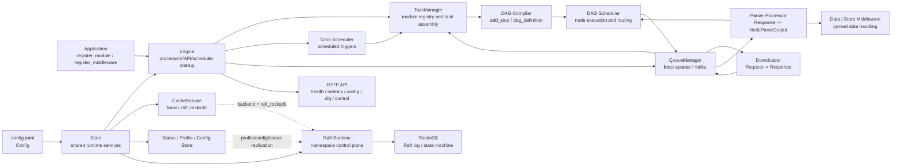
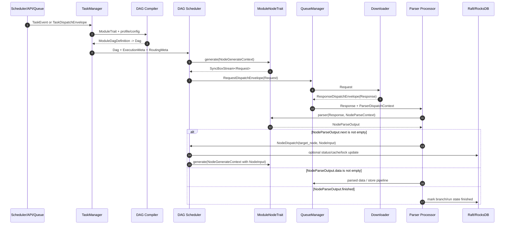

# Architecture

`mocra` is a crawler runtime library. Applications embed the library, register crawler modules, and let the runtime schedule request generation, downloading, parsing, storage, retries, and control-plane operations.

## Runtime Overview

The normal application entrypoint is:

```rust
let state = Arc::new(State::new("config.toml").await);
let engine = Engine::new(Arc::clone(&state), None).await?;
engine.register_module(MyModule::default_arc()).await;
engine.start().await;
```

The main runtime path is:

```text
Config file
  -> State
  -> Engine
  -> TaskManager
  -> ModuleTrait / ModuleNodeTrait
  -> DAG scheduler
  -> Queue manager
  -> Downloader
  -> Parser
  -> NodeParseOutput
  -> next node dispatch / parsed data / finish
```

## Core Architecture Diagram

The diagram focuses on scheduling and the Raft control plane. It shows how the core components fit together in single-node, local queue, Kafka queue, and Raft/RocksDB coordination deployments.



## Core Components

`State` owns shared runtime services derived from `Config`: cache, queue configuration, API configuration, Raft control-plane configuration, status tracking, and profile/config stores.

`Engine` wires the runtime together. It registers modules and middleware, starts processors, starts cron scheduling, starts queue/event handling, and exposes the HTTP API when configured.

`TaskManager` owns registered `ModuleTrait` implementations. It compiles module workflows into DAGs and loads runtime tasks from scheduled tasks, queue envelopes, responses, or parser/error dispatches.

`ModuleTrait` represents a crawler module. A module defines identity, version, default runtime behavior, optional cron scheduling, and either a linear step list or a custom DAG definition.

`ModuleNodeTrait` represents one workflow node. A node generates `Request` values and parses `Response` values into `NodeParseOutput`.

## Core Data Model Sequence

The sequence below follows the core data models through one node execution: task ingress, request generation, download, parsing, and downstream scheduling.



## Workflow Model

A module can be written as a linear workflow with `add_step()` or as an explicit DAG with `dag_definition()`.

When both are implemented, `dag_definition()` takes precedence and `add_step()` is ignored.

Each node receives typed runtime context:

- `NodeGenerateContext` during request generation;
- `NodeParseContext` during response parsing.

Parsing returns `NodeParseOutput`, which can:

- dispatch typed input to another node with `with_next(...)`;
- emit parsed data with `with_data(...)`;
- mark the workflow as complete with `finish()`.

## Queue and Transport

The queue layer supports local in-process queues and Kafka-backed transport. Queue payloads are represented as typed envelopes so task dispatch, request dispatch, response dispatch, parser dispatch, and error dispatch keep explicit routing and execution metadata.

Queue payloads can be encoded as JSON or MessagePack through `channel_config.queue_codec`.

Redis is not part of the current queue or synchronization design.

## Cache and Coordination

The cache backend is selected with `cache.backend`:

- `local`: local in-process cache;
- `raft_rocksdb`: Raft/RocksDB-backed distributed state.

When `raft` is present in the configuration, the node participates in the Raft control plane for its namespace. When `raft` is omitted, the runtime is a local single-node deployment.

## HTTP Control Plane

The optional HTTP API exposes health, metrics, task dispatch, cluster state, configuration CRUD, debug endpoints, DLQ operations, and runtime controls.

`/metrics` and `/health` are public. Operational and mutation endpoints are protected by the configured API key.

## Deployment Shapes

Local development uses local cache and local queues. This is the simplest mode for module development and tests.

Kafka deployment uses Kafka for queue transport while keeping coordination local or Raft-backed depending on `raft`.

Raft/RocksDB deployment enables shared coordination and state for a namespace. Each node needs a stable `config.name`, Raft address, and peer configuration.
