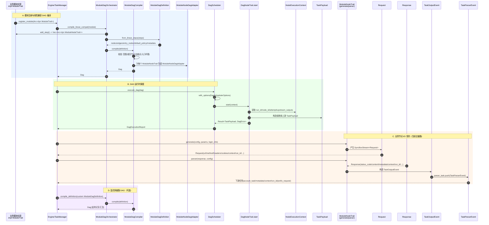

# ModuleTrait / ModuleNodeTrait / DAG 兼容层时序图

下面时序图覆盖两条主路径：

1. 线性兼容路径：`ModuleTrait.add_step -> ModuleDagDefinition::from_linear_steps -> compile -> execute`
2. 节点执行与数据契约路径：`Request -> Response -> TaskOutputEvent -> TaskParserEvent`

## 备注

- 兼容层核心是把 `ModuleTrait.add_step()` 返回的线性节点转为 `ModuleDagDefinition`，再编译成 `Dag`。
- `ModuleNodeDagAdapter` 是 `ModuleNodeTrait -> DagNodeTrait` 的桥接器。
- 在当前阶段，业务 I/O 仍保持 `Request/Response/TaskOutputEvent/TaskParserEvent` 契约不变。
