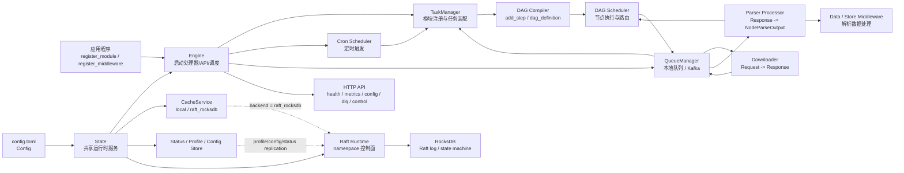
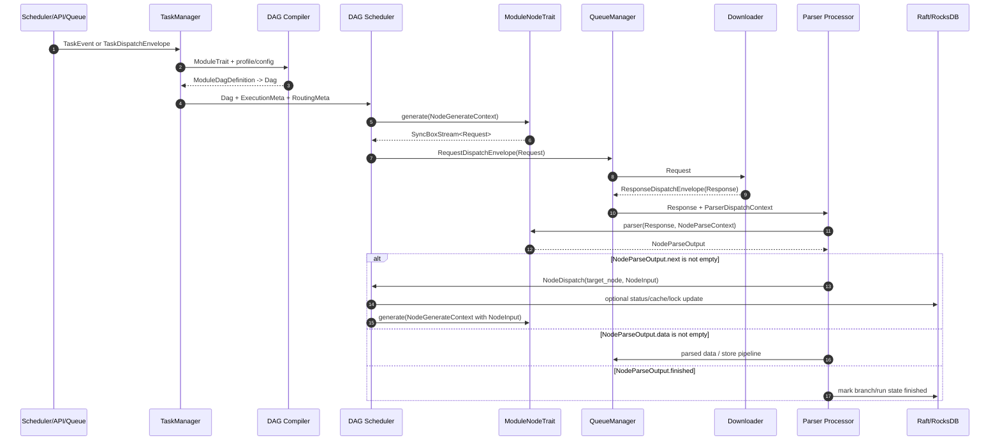

# 架构文档

`mocra` 是一个爬虫运行时库。应用程序嵌入该库，注册爬虫模块，然后由运行时负责请求生成、下载、解析、存储、重试和控制面操作。

## 运行时总览

常规应用入口：

```rust
let state = Arc::new(State::new("config.toml").await);
let engine = Engine::new(Arc::clone(&state), None).await?;
engine.register_module(MyModule::default_arc()).await;
engine.start().await;
```

主要运行链路：

```text
配置文件
  -> State
  -> Engine
  -> TaskManager
  -> ModuleTrait / ModuleNodeTrait
  -> DAG scheduler
  -> Queue manager
  -> Downloader
  -> Parser
  -> NodeParseOutput
  -> 后续节点分发 / 解析数据 / 完成
```

## 核心架构图

下图以调度链路和 Raft 控制面为主，展示 `mocra` 在单节点、本地队列、Kafka 队列和 Raft/RocksDB 协调下的核心组件关系。



## 核心组件

`State` 持有从 `Config` 派生出来的共享运行时服务，包括缓存、队列配置、API 配置、Raft 控制面配置、状态跟踪和 profile/config 存储。

`Engine` 负责组装运行时。它注册模块和中间件，启动处理器、Cron 调度、队列/事件处理，并在配置后暴露 HTTP API。

`TaskManager` 持有已注册的 `ModuleTrait` 实现。它将模块工作流编译为 DAG，并从调度任务、队列 envelope、响应、解析分发或错误分发中加载运行任务。

`ModuleTrait` 表示一个爬虫模块。模块定义身份、版本、默认运行行为、可选 Cron 调度，以及线性步骤或自定义 DAG。

`ModuleNodeTrait` 表示工作流中的一个节点。节点生成 `Request`，并将 `Response` 解析为 `NodeParseOutput`。

## 核心数据模型时序图

下图以几个核心数据模型为准，展示一次节点执行从任务进入、请求生成、下载、解析到后续调度的流转。



## 工作流模型

模块可以通过 `add_step()` 编写为线性工作流，也可以通过 `dag_definition()` 编写为显式 DAG。

如果两者同时实现，`dag_definition()` 优先，`add_step()` 会被忽略。

每个节点接收类型化运行上下文：

- 请求生成阶段使用 `NodeGenerateContext`；
- 响应解析阶段使用 `NodeParseContext`。

解析结果返回 `NodeParseOutput`，可以：

- 通过 `with_next(...)` 将类型化输入分发到另一个节点；
- 通过 `with_data(...)` 输出解析数据；
- 通过 `finish()` 标记工作流完成。

## 队列和传输

队列层支持本地进程内队列和 Kafka 传输。队列载荷使用 typed envelope 表示，让 task dispatch、request dispatch、response dispatch、parser dispatch 和 error dispatch 都携带明确的路由和执行元数据。

队列载荷可以通过 `channel_config.queue_codec` 配置为 JSON 或 MessagePack。

当前队列和同步设计不包含 Redis。

## 缓存和协调

缓存后端通过 `cache.backend` 选择：

- `local`：本地进程内缓存；
- `raft_rocksdb`：基于 Raft/RocksDB 的分布式状态。

配置中存在 `raft` 时，节点会加入该 namespace 的 Raft 控制面。省略 `raft` 时，运行时是本地单节点部署。

## HTTP 控制面

可选 HTTP API 暴露健康检查、指标、任务分发、集群状态、配置 CRUD、调试端点、DLQ 操作和运行时控制。

`/metrics` 和 `/health` 是公开端点。运维和变更类端点受 API key 保护。

## 部署形态

本地开发使用本地缓存和本地队列，是模块开发和测试的最简单模式。

Kafka 部署使用 Kafka 作为队列传输；协调状态根据是否配置 `raft` 决定是本地还是 Raft-backed。

Raft/RocksDB 部署为 namespace 启用共享协调和状态。每个节点需要稳定的 `config.name`、Raft 地址和 peer 配置。
