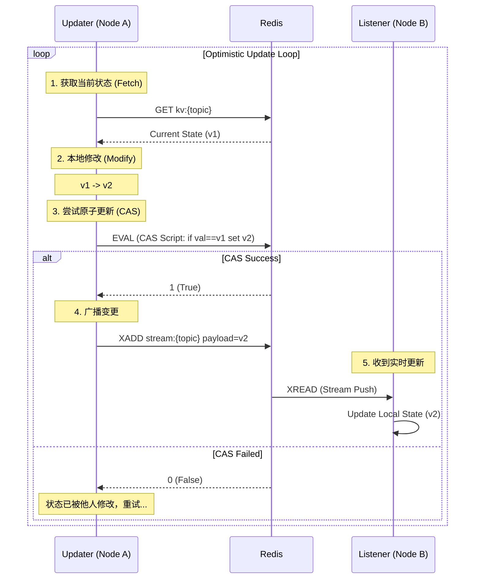

# Rust Distributed Sync 系统文档

本文档基于当前代码库 (`src/main.rs`, `src/sync/`) 编写，描述了一个基于 Rust 的分布式状态同步系统的设计与实现。支持 Redis、Kafka 以及单机本地模式。

## 1. 系统概述

该系统实现了一个轻量级的状态同步机制，允许多个节点（Updater/Listener）共享和同步应用状态 (`AppState`)。

### 核心特性
*   **多后端支持**: 支持 **Redis** (KV + Stream) 和 **Kafka** (KV via Redis + Topic) 作为同步后端。
*   **本地模式 (Local Mode)**: 支持单机高性能模式，无需外部依赖，使用内存 (`DashMap` + `RwLock`) 进行纳秒级同步。
*   **实时广播 (Broadcast)**: 确保所有订阅节点都能收到状态更新。
*   **状态持久化 (Persistence)**: 存储最新的状态快照，作为 "Source of Truth"。
*   **乐观并发控制 (Optimistic Concurrency)**: 采用 CAS (Compare-And-Swap) 机制，通过原子操作保证数据一致性。
*   **连接池管理**: 集成 `deadpool-redis` 进行高效的 Redis 连接复用。
*   **类型安全**: 利用 Rust 的泛型和 `serde` 序列化，保证传输数据的类型安全。

## 2. 架构设计

系统采用 **插件化存储架构**，通过 `MqBackend` Trait 屏蔽底层实现差异。

### 支持的模式

1.  **Redis 模式**:
    *   **KV**: 使用 Redis String 存储快照。
    *   **Stream**: 使用 Redis Streams 广播变更。
    *   **CAS**: 使用 Lua 脚本保证原子性。

2.  **Kafka 模式**:
    *   **KV**: 依然依赖 Redis 存储快照 (用于 CAS 和初始状态获取)。
    *   **Stream**: 使用 Kafka Topic 广播变更。
    *   **优势**: 更高的吞吐量潜力，适合海量消息堆积。

3.  **本地模式 (Local Mode)**:
    *   **KV**: 使用 `DashMap` + `RwLock` 存储在进程内存中。
    *   **Stream**: 使用 `tokio::sync::broadcast` 通道。
    *   **优势**: 极致性能 (20w+ QPS)，无网络开销，适合单机多任务协同。

### 数据流向图 (乐观更新流程)



## 3. 核心组件

### 3.1 `MqBackend` Trait
定义了底层消息队列和存储的抽象接口：
*   `publish`: 发送消息到 Stream。
*   `subscribe`: 订阅 Stream 更新。
*   `set` / `get`: 读写 KV 快照。
*   `cas`: **新增**。执行原子 Compare-And-Swap 操作 (`if current == old_val then set new_val`)。

### 3.2 `RedisBackend`
`MqBackend` 的 Redis 实现。
*   **连接池**: 使用 `deadpool_redis::Pool` 管理连接，避免频繁建立 TCP 连接的开销。
*   **CAS 实现**: 使用 Redis Lua 脚本 (`EVAL`) 确保 "检查旧值" 和 "设置新值" 是原子的。
*   **订阅机制**: 为每个订阅者创建一个唯一的 Consumer Group (`sync_group_{uuid}`)，并使用 `$` 偏移量实现广播模式。

### 3.3 `SyncService`
面向业务的高层服务，封装了 `MqBackend`。
*   **构造**: `new(backend: Option<Arc<dyn MqBackend>>)`。传入 `None` 即开启本地模式。
*   **`sync<T>`**: 启动同步。返回 `DistributedSync<T>` 句柄，内部启动监听任务。
*   **`send<T>`**: 强制覆盖更新（不检查冲突）。
*   **`optimistic_update<T, F>`**: **核心方法**。
    *   **分布式模式**: 执行 "Fetch -> Modify -> CAS" 循环，直到更新成功。
    *   **本地模式**: 获取写锁 -> 更新 -> 通知 (无循环，直接原子更新)。
*   **`fetch_latest<T>`**: 获取最新状态 (从 Redis 或 本地内存)。

### 3.4 `SyncAble` Trait
业务对象需要实现的 Trait，定义了该类型对应的 Topic 名称。

```rust
pub trait SyncAble: Send + Sync + Sized + 'static + Serialize + DeserializeOwned {
    fn topic() -> String;
}
```

## 4. 使用示例

以下代码展示了如何在 `main.rs` 中使用该系统：

### 4.1 定义状态
```rust
#[derive(Serialize, Deserialize, Debug, Clone)]
struct AppState {
    counter: u32,
}

impl SyncAble for AppState {
    fn topic() -> String {
        "app_state".to_string()
    }
}
```

### 4.2 初始化

**Redis 模式**:
```rust
let backend = Arc::new(sync::RedisBackend::new(REDIS_URL));
let sync_service = sync::SyncService::new(Some(backend));
```

**Kafka 模式**:
```rust
let redis_backend = Arc::new(sync::RedisBackend::new(REDIS_URL));
let kafka_backend = sync::KafkaBackend::new("localhost:9095", redis_backend);
let sync_service = sync::SyncService::new(Some(Arc::new(kafka_backend)));
```

**本地模式**:
```rust
// 传入 None 开启本地模式
let sync_service = sync::SyncService::new(None);
```

### 4.3 更新者 (Updater) 逻辑 - 乐观锁
```rust
// 自动处理 Fetch -> Modify -> CAS 循环 (或本地锁更新)
sync_service.optimistic_update::<AppState, _>(|state| {
    // 在闭包中定义修改逻辑
    if state.counter < 10 {
        state.counter += 1;
    }
}).await.unwrap();
```

### 4.4 监听者 (Listener) 逻辑
```rust
let mut distributed_sync = sync_service.sync::<AppState>().await.unwrap();

loop {
    // 等待变更通知
    if distributed_sync.changed().await.is_err() { break; }
    
    // 获取新值
    let state = distributed_sync.get();
    println!("Received: {:?}", state);
}
```

## 5. 关键实现细节

### 5.1 乐观锁与 CAS (Compare-And-Swap)
为了解决并发写入冲突，系统不再使用重量级的分布式锁（如 `SET NX`），而是采用乐观锁策略。
`RedisBackend::cas` 方法执行以下 Lua 脚本：
```lua
if redis.call('get', KEYS[1]) == ARGV[1] then
    return redis.call('set', KEYS[1], ARGV[2])
else
    return 0
end
```
这确保了只有当 Redis 中的值与我们读取到的 `old_val` 完全一致时，才会执行更新。如果期间有其他节点修改了值，CAS 会失败，`optimistic_update` 会重新获取最新值并重试。

### 5.2 键名隔离 (Namespacing)
为了避免 Redis `WRONGTYPE` 错误，系统强制使用了命名空间前缀：
*   KV 操作: `kv:{topic}`
*   Stream 操作: `stream:{topic}` (Redis) 或 `stream_{topic}` (Kafka)

### 5.3 连接池 (Connection Pooling)
引入 `deadpool-redis` 解决了高并发下的连接管理问题。`RedisBackend` 内部持有一个 `Pool` 对象，所有操作（publish, get, set, cas）都会从池中借用连接，操作完成后自动归还。

## 6. 性能基准 (Benchmark)

在 50 并发任务，每任务 50 次更新 (共 2500 次) 的测试场景下：

| 模式 | 吞吐量 (Updates/sec) | 延迟特性 | 适用场景 |
| :--- | :--- | :--- | :--- |
| **Redis** | ~2,800 | 低延迟 (<1ms) | 一般分布式同步，对延迟敏感 |
| **Kafka** | ~600 | 高延迟 (>5ms) | 高吞吐，消息持久化要求高 |
| **Local** | ~240,000 | 极低延迟 (ns级) | 单机多线程/协程同步 |
